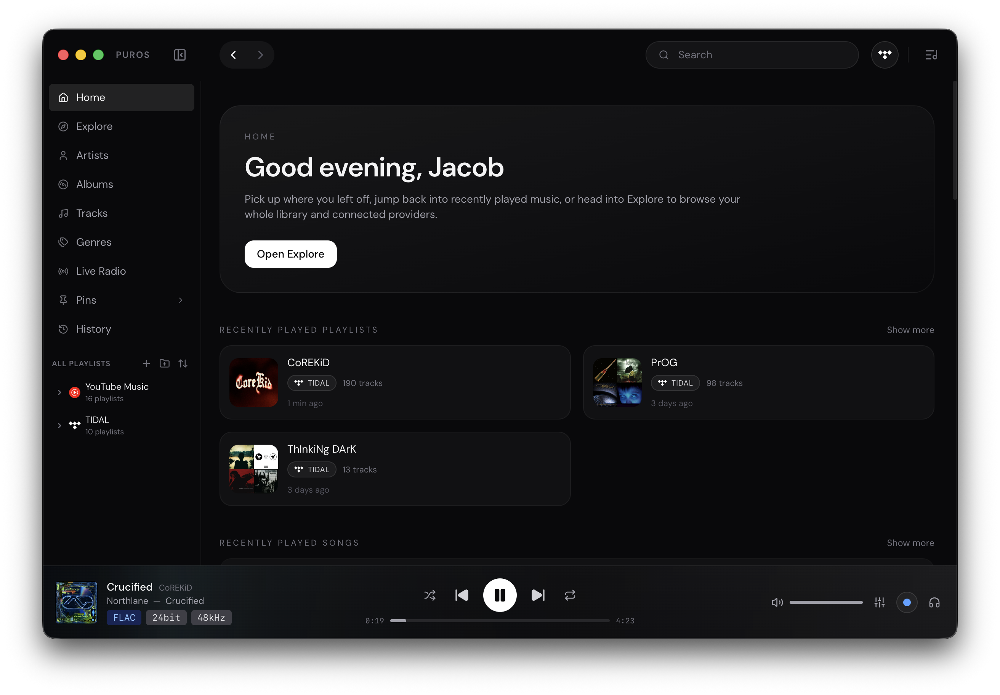

# Puros

**A macOS music player built for audio quality.**

Puros is a small team building a music player for people who care about sound, focus, and owning their library. It brings local playback and streaming together in one focused desktop app: see exactly what format is playing, control how your output device is driven, and keep a clean library without the clutter of a general-purpose streaming client.

Website: [getpuros.app](https://getpuros.app) · Discord: [join the community](https://discord.gg/AauwQm2fKe)

## Download

Compiled versions of Puros are published by hand on the [Releases](https://github.com/purosapp/purosapp/releases) page of this repository.

**[⬇ Download Puros](https://github.com/purosapp/purosapp/releases)**: the newest version is at the top.

> [!NOTE]
> Puros is in **alpha**. Expect rough edges and missing features, and keep a backup of anything important. Builds are for Apple Silicon Macs, signed with a Developer ID and notarized by Apple.

Download the `.dmg`, open it and drag Puros to Applications.

## Features

**Playback**

- CoreAudio exclusive mode for supported DACs and interfaces, with shared-mode fallback
- Per-device audio setup, including Bluetooth and AirPlay-aware routing
- Resampling with SoX (libsoxr), integer-ratio FIR filters or Apple CoreAudio, or none at all
- Format badges for sample rate, bit depth, bitrate, DSD and MQA

**Library**

- Local file scanning with full metadata indexing, and M3U playlists
- Queue, shuffle and now-playing controls
- Artist and album pages, genres, pins and listening history
- Live radio: browse Radio Browser stations or add your own streams

**Sound and extras**

- Parametric EQ with AutoEQ presets
- VST and VST3 effects
- MilkDrop-style visualizer
- Last.fm scrobbling and Discord Rich Presence

## Streaming integrations

Streaming services connect through **providers**: separate packages you install from **Settings → Accounts → Install provider…**. Puros keeps the library, queue, decoding, DSP and output; a provider handles sign-in, the service's catalog and preparing audio files.

Unofficial providers (SoundCloud, Spotify, TIDAL, YouTube Music and more) are listed in **[purosapp/providers-list](https://github.com/purosapp/providers-list)**. They are third-party software, not part of Puros, and Puros is not responsible for them.

Want to build one? Start with the **[Provider SDK](https://github.com/purosapp/puros-provider-sdk)**.

Questions, feedback or bug reports: come talk to us on [Discord](https://discord.gg/AauwQm2fKe).

## Requirements

- A Mac with Apple Silicon
- A CoreAudio-compatible output device
- An account for any streaming service you connect (optional)

## Open source

Puros itself is closed source. Selected parts of the ecosystem are public in this organization: the [Provider SDK](https://github.com/purosapp/puros-provider-sdk) and the [list of providers](https://github.com/purosapp/providers-list).
